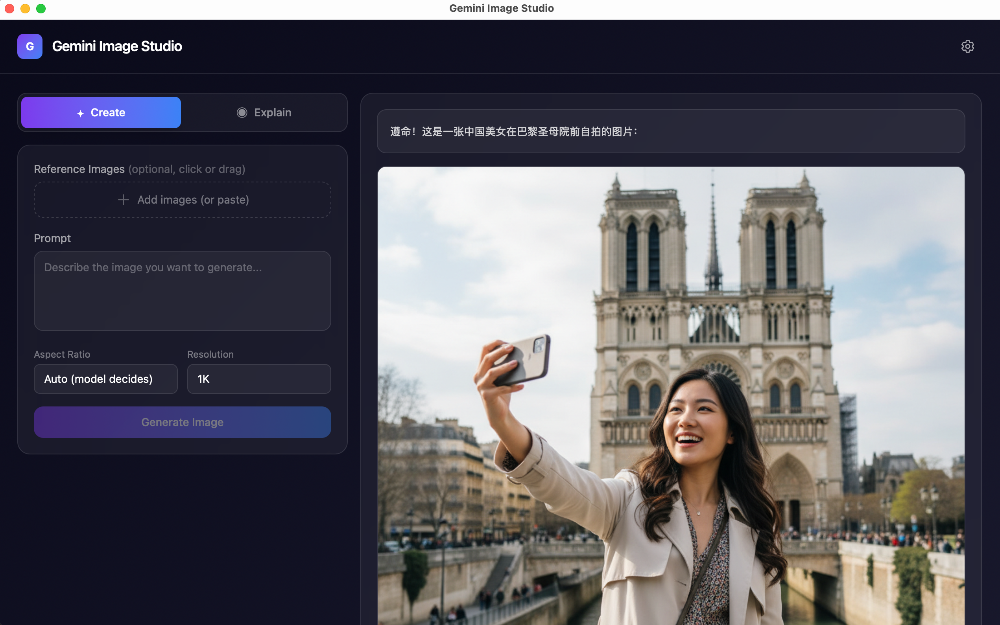

# Gemini Image Studio

基于 OpenRouter / Joybuilder API 调用 Gemini 模型的 AI 图片工作室。支持图片生成、编辑和解释。

## 界面预览



## 功能

- **Create** — 文字生成图片 / 上传图片 + 文字编辑图片（支持多张参考图）
- **Explain** — 上传图片，AI 分析解释图片内容（仅 OpenRouter）
- **多提供商** — 支持 OpenRouter 和 Joybuilder（京东云）两种 API 提供商，按需切换
- **本地保存** — 生成图片自动保存到本地文件夹
- **历史记录** — IndexedDB 持久化，关闭浏览器数据不丢失
- **模型切换** — 下拉选择 Flash / Pro 模型，支持自定义添加

## 技术选型

### 整体架构

```
┌─────────────────────────────────┐
│           用户界面               │  React + TypeScript + Tailwind CSS
│       (HTML/CSS/JS 渲染)        │  毛玻璃暗色主题 (Glassmorphism)
├─────────────────────────────────┤
│         API 客户端层             │  OpenRouter REST API
│   (图片生成 / 编辑 / 解释)       │  → Gemini 2.5 Flash Image
├─────────────────────────────────┤
│         数据持久化层             │  IndexedDB (历史记录 + 图片)
│   (浏览器本地存储)               │  File System Access API (本地文件保存)
├─────────────────────────────────┤
│         桌面打包层               │  Tauri (Rust + 系统 WebView)
│   (可选，非必需)                 │  产出 ~3MB vs Electron ~200MB
└─────────────────────────────────┘
```

### 前端框架：React + Vite + TypeScript

| 选择 | 原因 |
|------|------|
| **React** | 组件化开发，生态成熟，适合单页交互应用 |
| **Vite** | 极快的 HMR 热更新，构建速度快 |
| **TypeScript** | 类型安全，减少运行时错误 |
| **Tailwind CSS v4** | 原子化 CSS，快速构建 UI，无需写单独样式文件 |

### UI 风格：Glassmorphism 毛玻璃暗色主题

- 深色渐变背景 (`#0a0a1a → #1a1a2e`)
- 半透明毛玻璃卡片 (`backdrop-blur-xl + bg-white/5`)
- 紫蓝渐变强调色 (`#7c3aed → #3b82f6`)
- 现代 AI 工具风格的视觉语言

### API 调用：OpenRouter / Joybuilder → Gemini

支持两种 API 提供商，在设置界面切换：

#### OpenRouter

通过 OpenRouter 统一 API 格式（兼容 OpenAI）调用 Google Gemini 模型：

| 用途 | 模型 | 说明 |
|------|------|------|
| 图片生成/编辑 | `google/gemini-2.5-flash-image` | 支持文生图和图生图 |
| 图片解释 | `google/gemini-2.5-flash` | 快速视觉理解模型 |

关键参数：
- `modalities: ["image", "text"]` — 必须设置，否则只返回文字
- `stream: false` — 非流式请求，避免图片数据丢失
- 响应图片在 `message.images[].image_url.url`（base64 data URL）

#### Joybuilder（京东云）

通过 Joybuilder 平台调用 Gemini 模型，使用 Google 原生 Gemini API 格式：

| 用途 | 模型 | 说明 |
|------|------|------|
| 图片生成/编辑 | `Gemini 3-Pro-Image-Preview` | 支持 HTTP(S) URL 图片输入 |

请求格式：
```json
{
  "model": "Gemini 3-Pro-Image-Preview",
  "contents": { "role": "user", "parts": { "text": "prompt" } },
  "generation_config": { "response_modalities": ["TEXT", "IMAGE"] },
  "stream": false
}
```

限制：
- 不支持 Base64 图片输入，仅接受 HTTP(S) URL，因此 **Explain（图片解释）功能不可用**
- 端点：`/v1/images/gemini_flash/generations`

### 数据存储：IndexedDB

| 存储 | 用途 | 说明 |
|------|------|------|
| localStorage | 设置（API Key、模型选择） | 小量文本数据，< 5MB |
| IndexedDB | 历史记录（prompt + 图片） | 支持大容量，存 base64 图片不溢出 |
| File System Access API | 自动保存图片到本地文件夹 | 仅 Chrome/Edge 支持，可导出为 PNG 文件 |

为什么不用 localStorage 存图片：base64 图片单张 1-2MB，localStorage 上限 5MB，存 2-3 张就满了。IndexedDB 上限数百 MB，适合存图片。

### 桌面打包：Tauri vs Electron

选择 **Tauri** 而非 Electron：

| 对比 | Tauri | Electron |
|------|-------|----------|
| 安装包大小 | **~3 MB** | ~200 MB |
| 渲染引擎 | 系统 WebView (WebKit) | 内嵌 Chromium |
| 后端语言 | Rust | Node.js |
| 内存占用 | 低 | 高 |
| 原理 | 网页 + 原生窗口壳 | 网页 + 完整浏览器 |

Tauri 不是原生应用——本质是网页渲染在系统 WebView 中。对个人工具/内部产品完全够用。如需 100% 原生体验，需用 SwiftUI/Qt 重写。

#### Tauri 打包原理

```
npm run tauri:build  执行流程
│
├── 1. 前端构建 (Vite)
│   npm run build → 将 React/TS 编译为 HTML/CSS/JS → 输出到 dist/
│
├── 2. Rust 编译 (Cargo)
│   编译 src-tauri/ 下的 Rust 代码 → 生成平台原生二进制文件 (app)
│   Rust 代码仅负责：初始化窗口 + 注册原生插件 (文件对话框/文件系统)
│
├── 3. 资源打包
│   将前端 dist/ 内嵌到 Rust 二进制中 → 单个可执行文件
│
└── 4. 平台打包 (bundle)
    ├── macOS: 生成 .app → 再包装为 .dmg (Apple Silicon: aarch64)
    │   .app 内含: 可执行文件 + WebKit 资源 + 图标 + Info.plist
    │   .dmg 内含: .app + 背景图 + 快捷方式
    │
    └── Windows: 生成 .exe 安装包 / .msi

最终产物:
  src-tauri/target/release/bundle/
  ├── dmg/Gemini Image Studio_1.0.0_aarch64.dmg   ← macOS 安装包
  └── macos/Gemini Image Studio.app                ← macOS 应用
```

**为什么 Tauri 这么小？**
- 不打包浏览器：直接调用 macOS 自带的 WebKit (WKWebView) / Windows 的 WebView2
- Rust 编译后是原生机器码，不需要 Node.js 运行时
- 前端资源经 Vite 压缩后通常 < 100KB

**Tauri 的局限**
- 依赖系统 WebView：macOS 不同版本的 WebKit 行为可能略有差异
- 不支持跨平台打包：macOS 只能打 DMG，Windows 只能打 EXE
- 原生能力需要写 Rust 插件（本项目已实现文件对话框和文件保存插件）

## 快速开始

### 安装依赖

```bash
npm install
```

### 网页模式（开发）

```bash
npm run dev
```

浏览器访问 `http://localhost:5199`

### 网页模式（构建）

```bash
npm run build
npm run preview
```

### Tauri 桌面应用

需要先安装 Rust：

```bash
curl --proto '=https' --tlsv1.2 -sSf https://sh.rustup.rs | sh
```

#### 开发模式运行

```bash
npm run tauri:dev
```

#### 本地打包（当前平台）

```bash
# macOS 上打包 → 产出 .dmg（约 3 MB）
npm run tauri:build

# Windows 上打包 → 产出 .exe / .msi（约 3 MB）
npm run tauri:build
```

> **注意**：Tauri 不支持跨平台打包，macOS 只能打 dmg，Windows 只能打 exe。
> 如需同时产出 dmg + exe，使用下方 GitHub Actions 方案。

#### 通过 GitHub Actions 同时打包 dmg + exe

项目已配置 CI 工作流（`.github/workflows/build.yml`），**仅推送 tag 时触发**，普通 push 不会打包。

**方式一：推送 tag 自动触发**

```bash
# 1. 正常开发提交
git add .
git commit -m "feat: some change"
git push origin master

# 2. 准备发版时，打 tag 触发打包
git tag v1.0.0
git push origin v1.0.0

# 3. 更新版本时，重新打 tag
git tag -d v1.0.1 && git push origin :refs/tags/v1.0.1   # 删除旧 tag
git tag v1.0.2 && git push origin v1.0.2                  # 创建新 tag
```

**方式二：手动触发**

GitHub 仓库 → **Actions** → **Build Desktop App** → 点击 **Run workflow**

**下载安装包**

构建完成后，在 GitHub 仓库 → **Releases** 页面可下载：
- `Gemini Image Studio_x.x.x_aarch64.dmg`（macOS Apple Silicon）
- `Gemini Image Studio_x.x.x_x64-setup.exe`（Windows）

#### macOS 首次打开提示"已损坏"的解决方法

从网上下载的未签名应用会被 macOS Gatekeeper 拦截。打开终端执行：

```bash
sudo xattr -r -d com.apple.quarantine "/Applications/Gemini Image Studio.app"
```

或者对 DMG 文件：

```bash
sudo xattr -r -d com.apple.quarantine ~/Downloads/Gemini\ Image\ Studio_*.dmg
```

执行后即可正常打开。这是所有未购买 Apple 开发者证书（$99/年）的应用的通用问题，不影响安全性。

## 配置

首次打开会弹出设置窗口，需选择 API 提供商并配置对应参数：

### OpenRouter

| 配置项 | 说明 | 默认值 |
|--------|------|--------|
| API Key | OpenRouter API Key | - |
| Base URL | API 基础地址 | `https://openrouter.ai/api/v1` |
| Image Model | 图片生成模型 | `google/gemini-2.5-flash-image` |
| Vision Model | 图片解释模型 | `google/gemini-2.5-flash` |

### Joybuilder（京东云）

| 配置项 | 说明 | 默认值 |
|--------|------|--------|
| API Key | Joybuilder API Key | - |
| Base URL | API 基础地址 | `http://ai-api.jdcloud.com/v1` |
| Gemini Model | Gemini 模型选择 | `Gemini 3-Pro-Image-Preview` |

两个提供商的配置独立存储，切换时互不影响。

## 项目结构

```
src/
├── api/
│   ├── index.ts         # API 调度层（按 provider 路由）
│   ├── openrouter.ts    # OpenRouter API 客户端
│   ├── joybuilder.ts    # Joybuilder API 客户端
│   ├── db.ts            # IndexedDB 持久化存储
│   └── files.ts         # 本地文件保存
├── components/
│   ├── Header.tsx
│   ├── SettingsModal.tsx
│   ├── ModeSelector.tsx
│   ├── CreatePanel.tsx
│   ├── ExplainPanel.tsx
│   ├── ResultDisplay.tsx
│   └── ImageHistory.tsx
├── hooks/
│   └── useSettings.ts
├── types/
│   └── index.ts
├── App.tsx
├── main.tsx
└── index.css
src-tauri/              # Tauri 桌面应用配置
```
